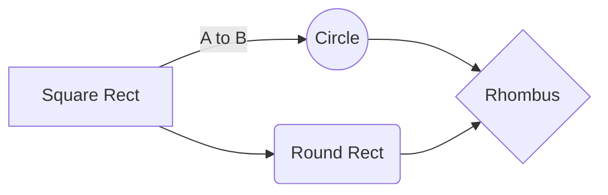
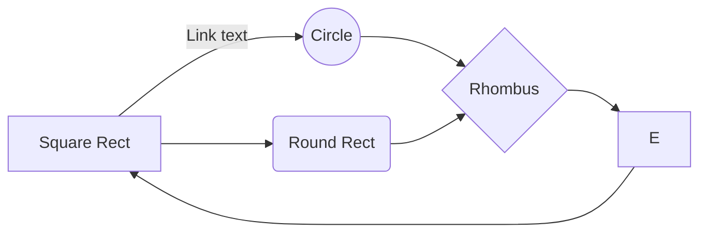
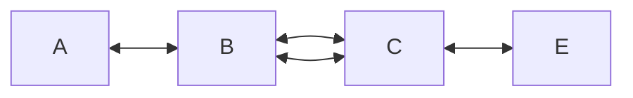
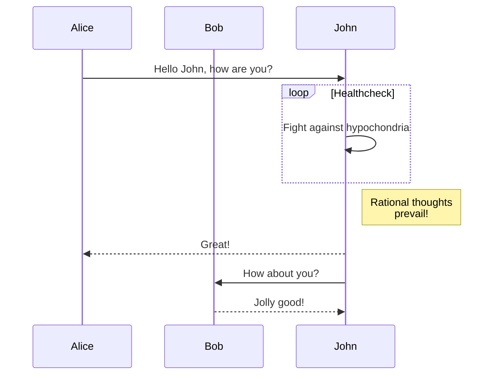

## Graph 1


```mermaid
graph LR
    A[Square Rect] -- A to B  --> B((Circle))
    A --> C(Round Rect)
    B --> D{Rhombus}
    C --> D
```

## Graph 2


```mermaid
graph LR
    A[Square Rect] -- Link text --> B((Circle))
    A --> C(Round Rect)
    B --> D{Rhombus}
    C --> D
    D --> E
    E --> A
```

## Topology 3


```mermaid
graph LR
 A <--> B
 B <--> C
 B <--> C
 C <--> E
```


```mermaid
sequenceDiagram
    participant Alice
    participant Bob
    Alice->>John: Hello John, how are you?
    loop Healthcheck
        John->>John: Fight against hypochondria
    end
    Note right of John: Rational thoughts <br/>prevail!
    John-->>Alice: Great!
    John->>Bob: How about you?
    Bob-->>John: Jolly good!
```

```python
print("Hello World")
```

